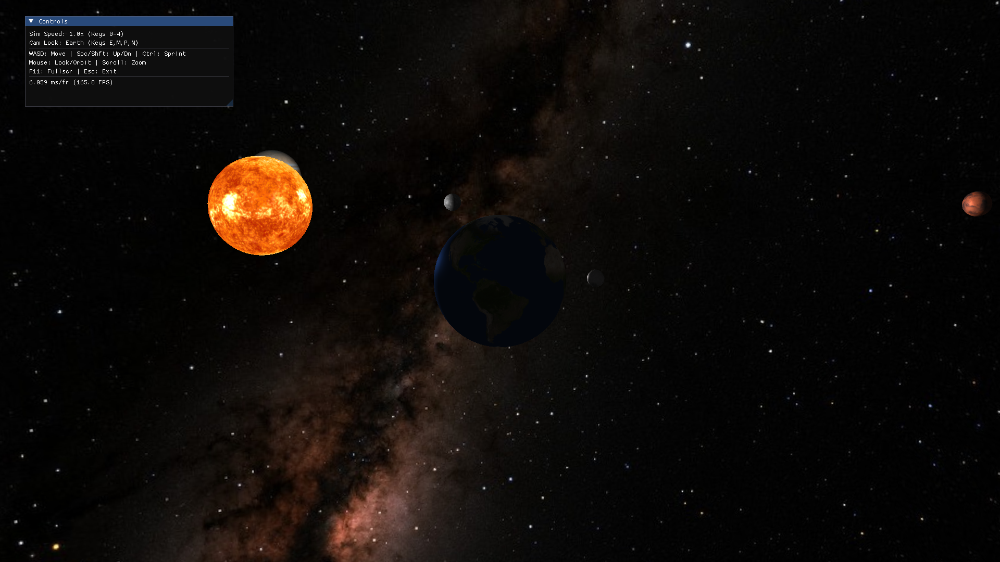

# 3D Solar System (OpenGL + C++)



A simple 3D solar system simulation built with C++ and modern OpenGL (3.3 Core Profile). This project demonstrates core computer graphics concepts including texturing, lighting, animation, hierarchical transformations, skyboxes, and basic UI overlays.

**Disclaimer:** This simulation uses artistic scaling for planet sizes and orbital distances to ensure visibility within the scene. It is **not** scientifically accurate in its representation of scale or orbital mechanics.

## Features

- **OpenGL Rendering:** Uses modern OpenGL (3.3 Core Profile) for rendering.
- **Textured Planets:** Celestial bodies (Sun, Mercury, Venus, Earth, Moon, Mars, Jupiter, Saturn, Uranus, Neptune) textured using images sourced from NASA/SolarSystemScope, rendered as spheres.
- **Phong Lighting:** Implements a basic Phong lighting model with the Sun as the primary light source. Emissive texture for the Sun.
- **Animation:** Planets rotate on their axes and orbit their parent bodies based on adjustable simulation time. Relative sizes and compressed distances aim for a sense of scale. Includes retrograde and axial tilt for Venus/Uranus.
- **Hierarchical Transformations:** Correctly applies parent matrix transformations for orbital mechanics.
- **Skybox:** Features a star-filled skybox using a cubemap texture for an immersive background (Textures based on NASA SVS visualization #4851).
- **Free-Fly Camera:** Navigate the scene using WASD (movement), Space/Shift (vertical), Ctrl (sprint), and mouse (look). Movement and look speed scale with zoom level (FOV).
- **Camera Locking:** Lock the camera to orbit specific planets using number keys. In locked mode, the mouse orbits the planet and the scroll wheel adjusts distance. Press 'N' to unlock. Zoom level resets upon locking.
- **Configuration File:** Uses `config.ini` to set window resolution and initial fullscreen state.
- **Fullscreen Toggle:** Press F11 to toggle fullscreen mode.
- **Dear ImGui Overlay:** Provides a simple, non-interactive overlay displaying current controls, simulation speed, camera lock status, and FPS.
- **Keyboard Controls:** Simulation speed and camera locking are controlled via keyboard shortcuts.
- **Cross-Platform Build:** Uses CMake for build configuration.
- **Devcontainer:** Includes a `.devcontainer` configuration for a reproducible development environment using Docker/VS Code.

## Tech Stack

- **Language:** C++17
- **Graphics API:** OpenGL 3.3 Core Profile
- **Windowing/Input:** GLFW
- **OpenGL Loading:** GLAD
- **Math:** GLM
- **Texture Loading:** stb_image
- **Configuration:** inih
- **GUI:** Dear ImGui

## Building and Running

### Using the Devcontainer (Recommended)

1.  Ensure you have Docker and VS Code with the "Dev Containers" extension installed.
2.  Clone the repository:
    ```bash
    git clone https://github.com/ztrahmet/opengl-solar-system.git
    cd opengl-solar-system
    ```
3.  Open the project folder in VS Code.
4.  VS Code should prompt you to "Reopen in Container". Click "Yes".
5.  Wait for the container to build (it will install necessary libraries like GLFW, GLM, X11 automatically).
6.  Once the container is ready, open a terminal in VS Code (**Terminal > New Terminal**).
7.  Run the build script:
    ```bash
    ./build_and_run.sh
    ```
    _(The first run will take longer as CMake downloads and configures Dear ImGui)._

### Manual Build (Linux Example)

1.  **Install Dependencies:** Make sure you have CMake, a C++17 compiler (like g++), OpenGL development libraries, GLFW, GLM, and X11 development libraries installed. On Debian/Ubuntu:
    ```bash
    sudo apt-get update
    sudo apt-get install build-essential cmake libglfw3-dev libglm-dev libgl1-mesa-dev libx11-dev
    ```
2.  **Clone the repository:**
    ```bash
    git clone https://github.com/ztrahmet/opengl-solar-system.git
    cd opengl-solar-system
    ```
3.  **Run the build script:**
    ```bash
    chmod +x build_and_run.sh
    ./build_and_run.sh
    ```
    _(Alternatively, build manually):_
    ```bash
    mkdir build
    cd build
    cmake ..
    make
    ./solar-system
    ```

## Controls

- **W, A, S, D:** Move camera horizontally (Free mode only)
- **Space:** Move camera up (absolute Y) (Free mode only)
- **Left Shift:** Move camera down (absolute Y) (Free mode only)
- **Left Control:** Sprint (increase movement speed) (Free mode only)
- **Mouse:** Look around (Free mode) / Orbit target (Locked mode)
- **Scroll Wheel:** Zoom FOV (Free mode) / Adjust distance (Locked mode)
- **0-4:** Set Simulation Speed (0x, 0.5x, 1x, 2x, 5x)
- **E:** Lock camera to Earth
- **M:** Lock camera to Mars
- **P:** Switch lock between other planets
- **N:** Unlock camera (return to Free mode)
- **F11:** Toggle fullscreen
- **Escape:** Close application

## Credits & Sources

- **Libraries:** GLAD, GLFW, GLM, stb_image, inih, Dear ImGui.
- **Planet Textures:** Sourced from [Solar System Scope](https://www.solarsystemscope.com/textures/).
- **Skybox Textures:** Based on NASA SVS visualization #4851 ([NASA SVS](https://svs.gsfc.nasa.gov/4851)).
